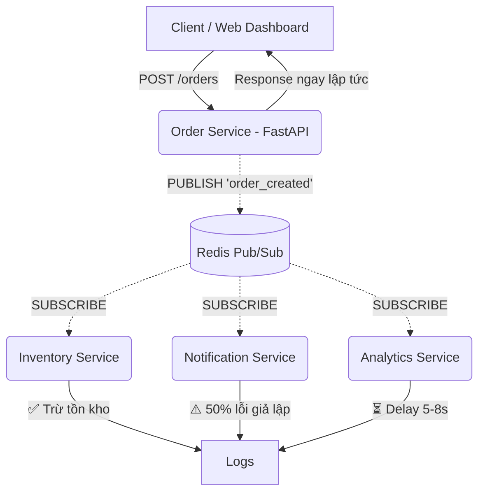

# 📦 Event-Driven Architecture — Sales System Prototype


Prototype hệ thống bán hàng áp dụng **Event-Driven Architecture (EDA)** sử dụng **Redis Pub/Sub** làm message broker. Khi một đơn hàng được tạo, hệ thống phát ra event `order_created` và các service độc lập xử lý bất đồng bộ.

Dự án bao gồm một **Web Dashboard** hiển thị luồng sự kiện (Live Event Stream) theo thời gian thực.

---

## 📑 Mục lục
- [1. Kiến trúc hệ thống](#1-kiến-trúc-hệ-thống)
- [2. Các thành phần](#2-các-thành-phần)
- [3. Quyết định kiến trúc](#3-quyết-định-kiến-trúc)
- [4. Hướng dẫn chạy (Local)](#4-hướng-dẫn-chạy-local)
- [5. Hướng dẫn Demo](#5-hướng-dẫn-demo)
- [6. Event Schema](#6-event-schema)

---

## 1. Kiến trúc hệ thống



## 2. Các thành phần

| Service | Vai trò | Hành vi đặc biệt |
|---------|---------|------------------|
| **Order Service** | Nhận đơn hàng, publish event | Trả response ngay, không chờ consumer |
| **Inventory Service** | Trừ tồn kho | Hoạt động bình thường (~0.5s/item) |
| **Notification Service**| Gửi email thông báo | **50% xác suất lỗi** — demo fault isolation |
| **Analytics Service** | Ghi nhận phân tích | **Delay 5-8 giây** — demo async |
| **Redis** | Message broker | Channel: `order_created` và `service_logs` |

---

## 3. Quyết định kiến trúc

- **Tách biệt (Decoupling):** Order Service là producer duy nhất — tách biệt logic tạo đơn hàng khỏi logic xử lý sau đó. Mỗi tác vụ phản ứng (inventory, notification, analytics) là một consumer độc lập, chạy trong container riêng.
- **Cơ chế truyền message:** Sử dụng **Redis Pub/Sub**. Một event publish lên channel sẽ được tất cả subscriber nhận (**fan-out** tự nhiên).
- **Fault Isolation (Cô lập lỗi):** Mỗi consumer bọc logic xử lý trong `try/except`. Service không crash khi gặp lỗi — log lỗi rồi tiếp tục lắng nghe. Order Service không bị ảnh hưởng nếu consumer lỗi.
- **Khả năng mở rộng (Scalability):** Thêm chức năng mới chỉ cần tạo service mới subscribe channel `order_created`, hoàn toàn tuân thủ *Open/Closed Principle*.

---

## 4. Hướng dẫn chạy (Local)

### Yêu cầu
- Docker Desktop đã cài và đang chạy.

### Khởi động hệ thống

```bash
# Clone repository
git clone https://github.com/YOUR_USERNAME/lab6.git
cd lab6

# Khởi động các container
docker-compose up --build -d
```

### Truy cập Web Dashboard
Mở trình duyệt và truy cập: **[http://localhost:8000](http://localhost:8000)**

Web Dashboard cho phép bạn:
- Tạo đơn hàng với dữ liệu mẫu chỉ bằng 1 click.
- Theo dõi **Live Event Stream** hiển thị log real-time từ tất cả các service (thông qua Server-Sent Events).

---

## 5. Hướng dẫn Demo

Bạn có thể demo trực tiếp trên Web Dashboard hoặc dùng lệnh curl/PowerShell.

### Kịch bản 1: Asynchronous Service Calling (Bất đồng bộ)
1. Tạo một đơn hàng trên Dashboard.
2. **Quan sát:** Thông báo "Order created successfully" hiện ra **ngay lập tức** (< 1 giây).
3. **Quan sát Live Event Stream:** Analytics Service vẫn báo `⏳ Processing analytics...` và mất 5-8 giây mới hoàn thành.
> 👉 **Chứng minh:** Thao tác tạo đơn hàng không bị block bởi các tác vụ xử lý nặng.

### Kịch bản 2: Fan-out Pattern
1. Tạo 1 đơn hàng duy nhất.
2. **Quan sát Live Event Stream:** Cùng 1 lúc, cả 3 service (Inventory, Notification, Analytics) đều nhận được thông tin về đơn hàng đó và bắt đầu xử lý.
> 👉 **Chứng minh:** 1 event được nhiều thành phần xử lý song song.

### Kịch bản 3: Fault Isolation (Cô lập lỗi)
1. Nhấn tạo liên tục 3-5 đơn hàng.
2. **Quan sát Live Event Stream:** 
   - Sẽ có lúc Notification Service báo lỗi màu đỏ `❌ Failed to send email — SMTP server unavailable` (xác suất 50%).
   - Tuy nhiên, Inventory và Analytics **vẫn xử lý bình thường** các đơn hàng đó. Order Service vẫn trả kết quả thành công.
> 👉 **Chứng minh:** Lỗi ở một thành phần không làm sập toàn bộ hệ thống hay ảnh hưởng đến luồng chính.

---

## 6. Event Schema

Định dạng JSON của event `order_created` gửi qua Redis:

```json
{
  "event_id": "550e8400-e29b-41d4-a716-446655440000",
  "event_type": "order_created",
  "timestamp": "2024-01-15T10:30:00.000000+00:00",
  "data": {
    "order_id": "a1b2c3d4-...",
    "customer_name": "Nguyen Van A",
    "items": [
      { "product": "Laptop", "quantity": 1, "price": 15000000 }
    ],
    "total": 15000000
  }
}
```
