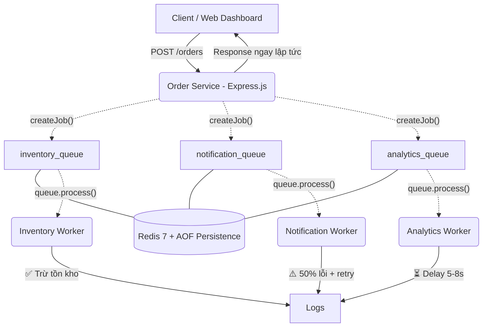

# 📦 Event-Driven Architecture — Sales System (Redis Bee Queue)


Prototype hệ thống bán hàng áp dụng **Event-Driven Architecture (EDA)** sử dụng **Redis Bee Queue** làm job queue. Khi đơn hàng được tạo, Order Service fan-out job vào 3 queue riêng biệt, mỗi worker service xử lý queue của mình một cách độc lập.

---

## 📑 Mục lục
- [1. Kiến trúc hệ thống](#1-kiến-trúc-hệ-thống)
- [2. Các thành phần](#2-các-thành-phần)
- [3. Quyết định kiến trúc](#3-quyết-định-kiến-trúc)
- [4. Hướng dẫn chạy](#4-hướng-dẫn-chạy)
- [5. Câu hỏi Demo](#5-câu-hỏi-demo)
- [6. Event Schema](#6-event-schema)

---

## 1. Kiến trúc hệ thống



## 2. Các thành phần

| Service | Vai trò | Bee Queue Config | Hành vi đặc biệt |
|---------|---------|-----------------|-------------------|
| **Order Service** | Producer — tạo đơn hàng, fan-out job | `isWorker: false` | Đẩy job vào 3 queue, trả response ngay |
| **Inventory Worker** | Worker — trừ tồn kho | `isWorker: true` | Progress reporting theo item |
| **Notification Worker** | Worker — gửi email | `isWorker: true` | **50% lỗi**, retry 3 lần tự động |
| **Analytics Worker** | Worker — phân tích | `isWorker: true` | **Delay 5-8s**, progress 10 bước |
| **Redis** | Job store + Message broker | AOF persistence | Data không mất khi restart |

---

## 3. Quyết định kiến trúc

### Tại sao Bee Queue thay vì Redis Pub/Sub?

| Tiêu chí | Redis Pub/Sub | Bee Queue |
|---|---|---|
| **Message persistence** | ❌ Fire-and-forget | ✅ Lưu trong Redis |
| **Retry khi lỗi** | ❌ Không | ✅ Built-in retries + backoff |
| **Điều khiển worker** | ❌ Không | ✅ `isWorker: true/false` |
| **Theo dõi job** | ❌ Không | ✅ Job events, progress, status |
| **Job ID tự động** | ❌ Phải tự tạo | ✅ Bee Queue gán `job.id` |
| **Fan-out** | ✅ Tự nhiên (broadcast) | ✅ Có kiểm soát (mỗi queue riêng) |

### Redis Configuration (`redis.conf`)

```conf
appendonly yes        # Bật AOF persistence — ghi mọi write vào disk
appendfsync everysec  # Flush mỗi giây
maxmemory-policy noeviction  # Không tự xoá key
```

---

## 4. Hướng dẫn chạy

### Yêu cầu
- Docker Desktop đã cài và đang chạy

### Khởi động

```bash
docker-compose up --build -d
```

### Truy cập Dashboard
Mở: **[http://localhost:8000](http://localhost:8000)**

Dashboard có 3 tab:
- **📊 Dashboard** — Tạo đơn hàng + Live Event Stream
- **🔧 Admin Panel** — Redis config, Queue health, Worker status
- **📋 Job Inspector** — Xem chi tiết job: ID, payload, status, progress

---

## 5. Câu hỏi Demo

### ❓ 1. Redis cấu hình gì?

> Mở tab **Admin Panel** → xem **Redis Configuration**.
> - `appendonly: yes` — bật AOF persistence để lưu data
> - `appendfsync: everysec` — flush ra disk mỗi giây
> - `isWorker: false` trên Order Service (producer only)
> - `stallInterval: 5000ms` — kiểm tra stalled job mỗi 5s

### ❓ 2. Có điều khiển được các subscriber không?

> **Có.** Bee Queue dùng `isWorker` flag:
> - `isWorker: true` → service sẽ lắng nghe và xử lý job
> - `isWorker: false` → service KHÔNG xử lý job, chỉ có thể tạo job
> 
> **Demo:** Stop container notification → tạo order → job nằm trong queue chờ → start lại → job được xử lý.

### ❓ 3. Thêm service nhưng không sub vô channel?

> **Có.** Tạo service với `IS_WORKER=false` trong docker-compose:
> ```yaml
> environment:
>   - IS_WORKER=false
> ```
> Service sẽ kết nối Redis bình thường nhưng **KHÔNG gọi `queue.process()`** → không nhận job nào.

### ❓ 4. Service sập thì sao? Có lưu được message không?

> **Có.** Bee Queue lưu job trong Redis (persistence bằng AOF).
> 
> **Demo:**
> 1. `docker stop eda-inventory-service`
> 2. Tạo đơn hàng → job được lưu vào `inventory_queue` trong Redis
> 3. `docker start eda-inventory-service`
> 4. Worker khởi động lại → tự lấy job từ queue → xử lý bình thường
> 
> Kiểm tra trên tab **Admin Panel** → Queue Health: thấy `waiting: 1`.

### ❓ 5. Xem service chạy như thế nào (payload)?

> Mở tab **📋 Job Inspector**:
> - Thấy danh sách tất cả job với ID, queue, status, progress
> - Nhấn **View** → modal hiển thị toàn bộ payload JSON, result, error
> - Mỗi job hiển thị: `event_id`, `event_type`, `timestamp`, `data` (order_id, customer, items, total)

### ❓ 6. Mỗi event có ID không?

> **Có.** Mỗi job Bee Queue tự động gán `job.id` (auto-increment).
> Ngoài ra, payload còn chứa `event_id` (UUID) do Order Service tạo.
> Trên Live Event Stream, mỗi log đều hiển thị `[Job #ID]`.

---

## 6. Event Schema

Job payload gửi qua Bee Queue:

```json
{
  "event_id": "550e8400-e29b-41d4-a716-446655440000",
  "event_type": "order_created",
  "timestamp": "2024-01-15T10:30:00.000Z",
  "data": {
    "order_id": "a1b2c3d4-...",
    "customer_name": "Nguyen Van A",
    "items": [
      { "product": "Laptop", "quantity": 1, "price": 15000000 }
    ],
    "total": 15000000,
    "status": "created",
    "created_at": "2024-01-15T10:30:00.000Z"
  }
}
```

Bee Queue tự gán thêm:
- `job.id` — auto-increment ID
- `job.retries` — số lần retry
- `job.timeout` — timeout
- `job.progress` — tiến độ (0-100%)
